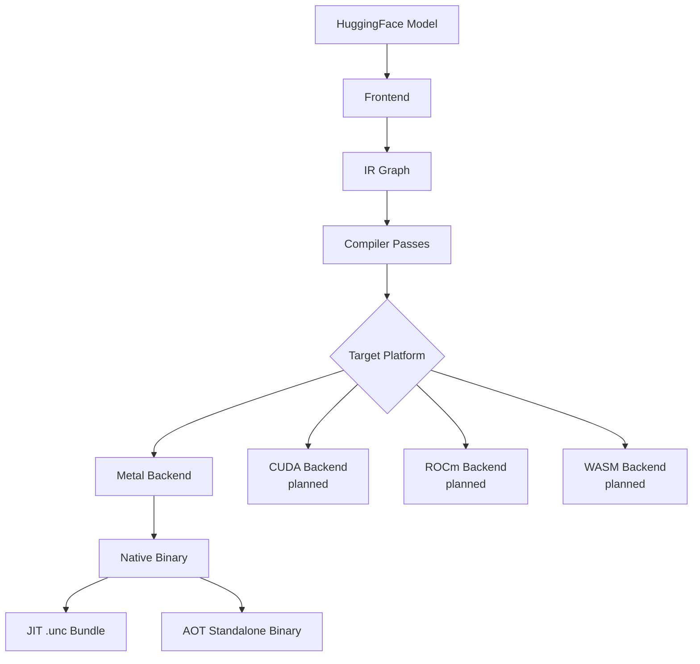

## Overview

UNC (Universal Neural Compiler) compiles HuggingFace transformer models into optimized native Metal inference binaries. The compiler eliminates Python runtime overhead and framework dispatch layers, achieving near-hardware-limit performance on Apple Silicon.

## High-Level Architecture

The UNC compilation pipeline transforms high-level model definitions into optimized native code:



## Core Components

### 1. Frontend

**Location**: `src/frontend/`

The frontend parses HuggingFace model configurations and builds the initial computation graph.

**Responsibilities**:
- Parse `config.json` from HuggingFace models
- Download model weights (safetensors) via HuggingFace Hub API
- Extract model parameters (hidden size, num layers, attention heads, etc.)
- Select appropriate model template based on architecture family
- Build initial IR graph using architecture-specific templates

**Supported Architectures**:
- **LLaMA** (LLaMA-2, LLaMA-3): `src/frontend/templates/llama.rs`
- **Mistral**: `src/frontend/templates/mistral.rs`
- **Qwen**: `src/frontend/templates/qwen.rs`
- **Phi**: `src/frontend/templates/phi.rs`
- **Gemma**: `src/frontend/templates/gemma.rs`

**Key Types**:
```rust
pub struct ModelFiles {
    pub config_json: PathBuf,
    pub tokenizer_json: Option<PathBuf>,
    pub weight_files: Vec<WeightFile>,
    pub model_id: String,
}

pub enum WeightFile {
    Safetensors { path: PathBuf, shard_index: Option<usize> },
    Gguf { path: PathBuf },
}
```

### 2. IR Graph (Intermediate Representation)

**Location**: `src/ir/`

The IR is a hardware-agnostic typed tensor graph representing model computation at the right abstraction level for optimization.

**Design Philosophy**:
- **Above multiply-adds**: Too low-level for pattern matching
- **Below transformer blocks**: Too high-level for kernel selection
- **Clean kernel mapping**: Each op maps to one or more GPU kernel launches

**Key Operations** (`src/ir/ops.rs`):
- **MatMul operations**: `MatMul`, `BatchMatMul`, `QuantizedMatMul`, `QuantizedMatVec`
- **Normalization**: `RMSNorm`, `LayerNorm`, `QKNorm` (Qwen3-style per-head norm)
- **Attention**: `ScaledDotProductAttention`, `RoPE`, `KVCacheAppend`
- **Activations**: `SiLU`, `GELU`, `ReLU`
- **Elementwise**: `Add`, `Mul`, `Scale`
- **Memory ops**: `Gather`, `Reshape`, `Transpose`, `Concatenate`, `Split`
- **Fused ops**: `SwiGLU`, `QKVProjection`, `LinearActivation`

**Type System** (`src/ir/types.rs`):
```rust
enum DType {
    F32, F16, BF16,
    Q8_0,  // 8-bit quantized: 32 elements/block, 1 f16 scale
    Q4_0,  // 4-bit quantized: 32 elements/block, 1 f16 scale
    Q4_1,  // 4-bit quantized: scale + min
    I32, U32, Bool,
}

enum Dim {
    Static(usize),           // Known at compile time (e.g., hidden_dim=4096)
    Param(ParamDim),         // Runtime-known but bounded (e.g., seq_len ∈ [1, 8192])
}
```

See [IR Graph](/concepts/ir-graph) for detailed documentation.

### 3. Compiler Passes

**Location**: `src/compile/`

The compiler applies a series of optimization passes to transform and optimize the IR graph.

**Pass Pipeline** (`src/compile/mod.rs`):
1. **Weight Binding Resolution**: Resolve weight tensor byte offsets in safetensors files
2. **Dead Code Elimination**: Remove unused operations
3. **QKV Fusion**: Fuse Q/K/V projections into single kernel
4. **Elementwise Fusion**: Fuse Add+RMSNorm, SiLU+Mul (SwiGLU), etc.
5. **Attention Fusion**: ScaledDotProductAttention is already lowered from templates
6. **Dual Path Insertion**: Create separate prefill (GEMM) and decode (GEMV) paths
7. **Kernel Matching**: Assign specific Metal kernels to each operation
8. **Layout Optimization**: Ensure tensors use expected memory layout
9. **Memory Planning**: Allocate activation buffers with lifetime-based aliasing
10. **Scheduling**: Topological ordering (already handled by templates)

**Memory Planning**:
- Greedy interval-graph coloring for buffer aliasing
- Reuse activation buffers when lifetimes don't overlap
- Separate KV cache allocation (persistent across decode steps)
- Split decode regions for concurrent dispatch

See [Compiler Pipeline](/concepts/compiler-pipeline) for details.

### 4. Metal Backend

**Location**: `src/emit/`, `kernel_sources/metal/`

The Metal backend generates optimized Objective-C orchestrator code and kernel dispatches.

**Code Generation** (`src/emit/metal.rs`):
- Generate Objective-C/C orchestrator that dispatches Metal kernels
- Create runtime functions: `unc_init()`, `unc_forward()`
- Handle prefill/decode dual-path branching
- Emit buffer bindings for weights, activations, KV cache
- Generate quantization kernels (BF16→F16, F16→Q4_0/Q8_0)

**Custom Metal Kernels** (`kernel_sources/metal/unc_kernels/`):
- Fused GEMV (quantized matrix-vector for decode)
- Fused RoPE+KV+SDPA (rope_qk_kv_append, sdpa_rope_kv_decode)
- Fused QKV/Gate+Up GEMV (eliminates dispatch overhead)
- PSQ (Partial Sum-of-Squares) pipeline for RMSNorm
- Optimized SDPA with causal masking

**MLX Reference Kernels** (`kernel_sources/metal/upstream_mlx/`):
- QMV (quantized matrix-vector) from MLX
- SDPA vector attention headers

### 5. Output Modes

UNC supports two compilation modes:

**JIT Mode** (default):
- Output: `.unc` bundle (serialized graph + orchestrator source)
- JIT-compiled via clang at first run
- Cached thereafter for fast startup
- Best for: Development, iteration

**AOT Mode** (`--binary`):
- Output: Standalone Mach-O binary
- Zero dependencies (embedded weights, metallib, tokenizer)
- Instant startup (no compilation step)
- Best for: Deployment, distribution

**Binary Layout** (AOT):
```
[Mach-O code][padding to 16KB][weights][8B offset][8B size][8B magic]
```

See [Output Modes](/concepts/output-modes) for details.

## Component Interaction

### Compilation Flow

```
1. Frontend downloads HuggingFace model
   ↓ (ModelFiles)
2. Frontend selects template (LLaMA, Mistral, etc.)
   ↓ (CompGraph with placeholder weight offsets)
3. Compiler runs optimization passes
   ↓ (Optimized CompGraph + MemoryPlan)
4. Backend generates Metal code
   ↓ (Orchestrator source + metallib)
5. Output emission
   ↓ (JIT .unc bundle OR AOT binary)
```

### Runtime Flow (JIT)

```
1. Load .unc bundle (deserialize graph)
2. JIT compile orchestrator via clang (cached)
3. Load Metal library and create PSOs
4. mmap weights from safetensors
5. Quantize weights on GPU (if q4_0/q8_0)
6. Allocate activation buffers and KV cache
7. Forward pass:
   - Prefill: GEMM kernels (batch matmul)
   - Decode: GEMV kernels (matrix-vector)
   - Dispatch Metal compute commands
8. Sample next token, repeat
```

### Runtime Flow (AOT)

```
1. Binary is self-contained executable
2. Extract embedded metallib to temp file
3. mmap weights from appended binary section
4. Load Metal library and create PSOs
5. Weights already in BF16, convert to F16 on GPU
6. Quantize if needed
7. Forward pass (same as JIT)
```

## Performance Characteristics

### Why UNC is Fast

1. **Zero Python overhead**: Compiled C/Metal, no interpreter
2. **Optimized kernel fusion**: Reduces dispatch overhead by 3-5x
3. **Dual-path execution**: Separate GEMM (prefill) and GEMV (decode) paths
4. **Quantization**: Q4_0 achieves 2x speedup vs F16 on memory-bound workloads
5. **Memory efficiency**: Lifetime-based buffer aliasing reduces peak memory
6. **PSQ pipeline**: Eliminates dispatch boundaries for normalization
7. **Metal-optimized kernels**: Hand-tuned for Apple Silicon

### Benchmark Results

**TinyLlama 1.1B on M1 Pro (Q4_0)**:
- UNC: 152 tok/s
- mlx-lm: 113 tok/s
- **1.35x faster, 25% less GPU power, 1.7x better energy efficiency**

## Target Detection

**Location**: `src/target/`

The compiler detects Apple Silicon GPU capabilities:
- M1/M2/M3 family detection
- Memory bandwidth (200-800 GB/s)
- Threadgroup memory size
- SIMD width (32 threads)

Kernel selection adapts to target hardware for optimal performance.

## Future Backends

The IR is designed to be hardware-agnostic:
- **CUDA**: PTX kernel generation (planned)
- **ROCm**: HIP kernel generation (planned)
- **WASM**: WebGPU shader generation (planned)
- **CPU**: Acceleration via Intel oneDNN (planned)

Same IR graph can target multiple backends with backend-specific code generation.

## Related Documentation

- [Compiler Pipeline](/concepts/compiler-pipeline) - Detailed optimization passes
- [IR Graph](/concepts/ir-graph) - Intermediate representation design
- [Output Modes](/concepts/output-modes) - JIT vs AOT comparison
